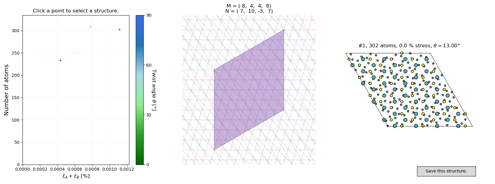

# Hetbuilder

[](https://zenodo.org/badge/latestdoi/358881237)

Builds 2D heterostructure interfaces via coincidence lattice theory.

## Installation

Requires a C++17 compiler, [cmake](https://cmake.org/) at least with version 3.18.4, as well as [spglib](https://atztogo.github.io/spglib/python-spglib.html) and [pybind11](https://github.com/pybind/pybind11). 
All can be installed with Anaconda:

```bash
conda install -c conda-forge cxx-compiler git pip cmake spglib pybind11
```

Then you can install the tool via pip:

```bash
pip install hetbuilder
```

## First steps

The installation exposes a single [typer](https://github.com/tiangolo/typer) CLI utility called `build_heterostructure`:

```bash
build_heterostructure --help
```

You can use any ASE-readable structure format to specify the lower and upper layer. They should be recognizable as two-dimensional, e.g., by having a zero vector in the *z*-direction.

```bash
build_heterostructure graphene.xyz MoS2.cif
```

This should open a [matplotlib](https://matplotlib.org/) interface looking like this:




## Testing

Tests can be run in the project directory with

```bash
pytest -v tests
```


## Requirements

- [Atomic Simulation Environment](https://wiki.fysik.dtu.dk/ase/)
- [Space Group Libary](https://atztogo.github.io/spglib/python-spglib.html)
- [SciPy](https://www.scipy.org/)
- [matplotlib](https://matplotlib.org/)
- [pybind11](https://github.com/pybind/pybind11)
- [typer](https://github.com/tiangolo/typer)
